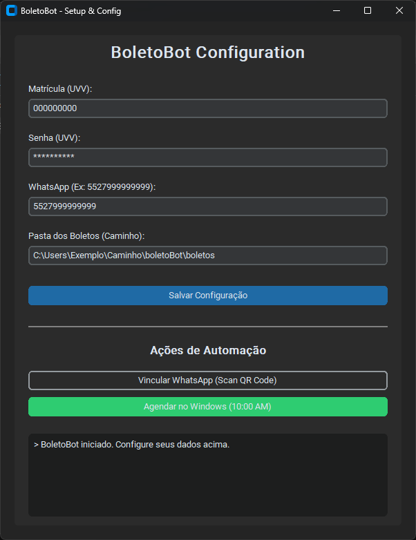

# boletoBot


O **boletoBot** é um projeto pessoal criado para resolver o problema de esquecer de pagar mensalidades na data certa.

A automação atualmente acessa o portal do aluno, identifica se há faturas pendentes, faz o download do documento em PDF e o envia automaticamente para um contato do WhatsApp uma semana antes do vencimento. O objetivo é evitar o trabalho manual repetitivo de realizar login, navegar por menus, baixar o arquivo e encaminhar para si mesmo, e principalmente evitar que eu acabe esquecendo de pagar o boleto.

Está em estagio incial de desenvolvimento pois primordialmente era um projeto apenas para uso pessoal e local, mas como comentei com um colega sobre, acabei tendo a ideia de torna-lo algo acessivel para todos. 
O projeto atualmente peca em tratamento de erros e organização de diretórios, dois pontos que estão como prioridade máxima e logo mais serão aprimorados. No mais agradeço a compreensão. 

<p align="center">
  
</p>


# Configuração Rápida para Usuários não programadores

Caso você prefira o modo tradicional com linha de comando, pode ignorar esta seção e [ir direto para o Setup](#setup).

Conversando com um amigo percebi que o estado antigo do projeto não era muito amigavável com pessoas que não são familiarizadas com programação. Por isso, atualizei o projeto para que ele seja de fácil uso para qualquer pessoa, implementei uma janela de configuração simples e direta para inserir as informações necessárias e agendar o bot.

Após o primeiro teste, percebi o obvio: um usuário comum não vai ter o pyhton instalado para rodar os scripts diretamente. Por isso, gerei um executável que já vem com o python incluso.

1.  **Baixe o Executável:** Vá na aba [**Releases**](https://github.com/jpbecker23/boletoBot/releases) do repositório e baixe a versão mais recente do `BoletoBot.exe`.
2.  **Execute:** Coloque o arquivo em uma pasta de sua preferência e execute-o.
    **Observação importante:** Como o executável não é assinado digitalmente, o Windows pode mostrar um aviso de "O Windows protegeu o seu computador" ao abrir pela primeira vez. Basta clicar em "Mais informações" e depois em "Executar assim mesmo".

3.  **Configure:** Preencha seus dados de matrícula, senha e número do contato de quem vai recber o boleto na janela que abrirá.
4.  **Vincule o WhatsApp:** Clique em "Vincular WhatsApp" para abrir o navegador e ler o QR Code (isso só é feito uma vez).
5.  **Agende:** Clique em "Agendar no Windows" para que o robô trabalhe para você todos os dias às 10:00.

> [!TIP]
> Na primeira vez que você clicar em um botão de ação, o robô pode demorar alguns segundos para baixar as dependências do navegador (Chromium). Isso é normal e só acontece uma vez!

# Features

- **Extração Automatizada:** Realiza login HTTP e varredura do DOM no portal para encontrar boletos.
- **Download Condicional:** Baixa o arquivo localmente apenas se o status financeiro constar como aberto.
- **Delivery via WhatsApp Web:** Manipula o navegador de forma autônoma para anexar e enviar o PDF.
- **Validação de Prazo:** Avalia uma janela de segurança (ex: envia apenas faltando poucos dias para o vencimento).
- **Idempotência e Arquivamento:** Arquivos enviados com sucesso são movidos para uma pasta secundária, evitando duplicidade de execução.
- **Sessão Persistente:** Salva os cookies e o contexto do Chrome localmente, evitando a leitura contínua de QR Codes do WhatsApp.

# Stack
- **Linguagem:** Python 3.x
- **Interface Gráfica (GUI):** `customtkinter` para uma experiência de configuração moderna e intuitiva.
- **Extração de Dados:** `requests` para sessão HTTP estática e `beautifulsoup4` para estruturação e extração das tabelas HTML.
- **Automação de UI (RPA):** `playwright` com Chromium para a operação da interface do WhatsApp Web.
- **Configuração:** `python-dotenv` para injeção limpa de credenciais locais.
- **Automação de Sistema:** PowerShell para integração e agendamento automático de tarefas no Windows.

# Estrutura do Projeto

Como é um projeto pequeno e iniciei ele com o objetivo de uso pessoal apenas, a organização de diretórios atualmente não segue nenhum padrão, mas logo irei refatorar seguindo as melhores práticas de arquitetura de software.
(Atualmente penso em seguir POM ou DDD mas caso você tenha alguma sugestão, agradeço muito se você decidir compartilhar comigo!)

```text
boletoBot/
├── auth/                 # Pasta autogerada: armazena cookies e sessão ativa do WhatsApp
├── boletos/              # Staging area: PDFs aguardando regra de data para envio
│   └── enviados/         # Arquivo morto: faturas já processadas e enviadas
├── scripts/              # Scripts de suporte e automação (PowerShell)
├── venv/                 # Ambiente virtual
├── .env                  # Variáveis de ambiente e segredos
├── baixar_boletos.py     # Script HTTP de ingestão (portal -> boletos/)
├── enviar_boletos.py     # Script RPA de entrega (boletos/ -> WhatsApp)
├── configurator.py       # Interface gráfica de configuração (GUI)
└── run_configurator.bat  # Atalho amigável para lançar o configurador
```

# Como Funciona

A lógica do projeto é dividida em dois scripts independentes que conversam através da pasta de arquivos. Isso é ótimo porque, se um lado der problema, o outro continua funcionando normalmente.

1. **Camada de Ingestão (`baixar_boletos.py`):** Realiza uma requisição "burra" e veloz, mantendo os cookies do servidor para autenticar no portal. Lê o HTML, encontra faturas pendentes e gera um PDF na pasta `boletos/`, utilizando como metadado a data limite no nome do arquivo.
2. **Camada de Entrega (`enviar_boletos.py`):** Age como um robô persistente que lê a pasta de boletos. Avalia se o documento atual cruza o limite temporal definido. Caso afirmativo, ergue uma instância isolada do navegador com o login do WhatsApp já injetado, busca pelo campo de texto, faz o upload do anexo e encaminha o arquivo com segurança para a pasta `enviados/`.

Essa separação garante resiliência: se o portal ficar offline, o bot ainda despacha arquivos que já foram baixados. Se a interface do WhatsApp mudar, a rotina de baixar novas faturas segue inalterada.

# Setup

**1. Clone o repositório**
```bash
git clone https://github.com/seu-usuario/boletoBot.git
cd boletoBot
```

**2. Isole o ambiente**
Crie e ative um ambiente virtual.
```bash
python -m venv venv

# Windows
.\venv\Scripts\activate

# Linux / macOS
source venv/bin/activate
```

**3. Instale as dependências**
Será necessário instalar as bibliotecas base e os binários da engine do Chromium.
```bash
pip install -r requirements.txt
playwright install chromium
```

**4. Configure o `.env`**
O projeto conta com um arquivo `.env.example` que serve como modelo para a criação do arquivo `.env`. Nunca commite este arquivo.

**5. Primeiro login do robô**
A primeira execução exigirá o pareamento da sua conta. Edite temporariamente o arquivo `enviar_boletos.py` para levantar o navegador sem a flag `headless`, rode o arquivo e escaneie o QR Code pelo seu celular. A sessão ficará gravada em `auth/`.

**6. Automação (Windows Task Scheduler)**
Para que o bot funcione de forma 100% autônoma, você pode criar uma tarefa no **Agendador de Tarefas do Windows**:
- Configure o gatilho para rodar diariamente em um horário de sua preferência.
- Na ação, aponte para o executável do Python dentro do seu ambiente virtual (`venv\Scripts\python.exe`).
- Como argumento, passe o caminho dos scripts (`baixar_boletos.py` e `enviar_boletos.py`).

# Configuração

O sistema depende de poucas, mas críticas, variáveis de ambiente configuradas no seu arquivo `.env`:

```env
# Acesso ao portal educacional
MATRICULA=sua_matricula_aqui
PASSWORD=sua_senha_aqui

# Destinatário do bot (Seu número com DDD, formato DDI+DDD)
CONTATO=5511999999999

# Caminho absoluto da pasta de transição no seu SO
ARQUIVO=C:\Caminhos\Absolutos\Ate\boletoBot\boletos
```
# Segurança

Este projeto foi construído assumindo execução estrita em localhost ou infraestrutura de uso particular e isolado:

- **Credenciais Locais:** Suas senhas da faculdade vivem abertamente no arquivo `.env`. Jamais exporte este dado.
- **Sessão do WhatsApp:** O diretório `auth/` contém sua sessão materializada. Ter esse arquivo em mãos equivale a ter o seu celular logado no WhatsApp Web. Não versione esta pasta e adicione-a imediatamente ao `.gitignore`.
- **Sensatez de Uso:** Esta automação mascara suas requisições baseada em flags padrões e destina-se puramente ao uso pessoal, não focando em contornar banimentos e tampouco desenhada para abusar do envio em massa.

# Contribuição

Irei tornar este projeto público a fim de ajudar outros alunos com a mesma dificuldade ou que apenas querem automatizar um processo chato e repetitivo. Caso você queira contribuir com o projeto, seja com uma feature nova ou uma fix abra uma Issue explicando, e sinta-se confortável para abrir um Pull Request. Melhorias arquiteturais também são muito bem-vindas. Agradeço a colaboração!


